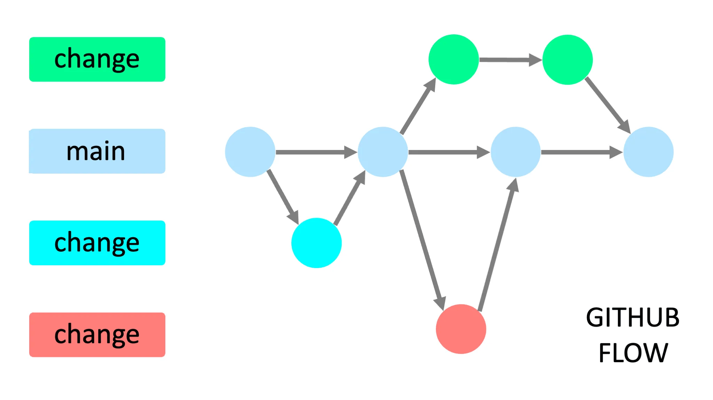

# 🚀 Project ACM-X

Welcome to the FEU Tech ACM App repository!

This repository contains the FEU Tech ACM Organization's official cross-platform application source code.

The app is being developed to serve as the central platform for communication, collaboration, and promotion of every ACM member and officer in education, opportunities, and beyond.

## Tech Stack

- [Next.js](https://nextjs.org)
- [TypeScript](https://www.typescriptlang.org/)
- [NextAuth.js](https://next-auth.js.org)
- [Prisma](https://prisma.io)
- [PostgreSQL](https://www.postgresql.org/)
- [Tailwind CSS](https://tailwindcss.com)
- [tRPC](https://trpc.io)
- [ShadcnUI](https://ui.shadcn.com/)
- [PNPM](https://pnpm.io/)

## Development

### Pre-requisites

- [Git](https://git-scm.com/)
- [PNPM](https://pnpm.io/)
- [Visual Studio Code](https://code.visualstudio.com/)

Alternatively, you can setup a GitHub Codespace on the [project repository](https://github.com/feutechacmx/acmx).

### Getting Started

1. Clone the repository and change directory.

```bash
git clone https://github.com/FEUTechACM/acm-app.git acm-app
# or
git clone git@github.com:FEUTechACM/acm-app.git acm-app
# then, change directory
cd acm-app
```

1. Switch to target branch.

    ```bash
    git checkout <target branch>
    ```

2. Install the dependencies.

    ```bash
    pnpm install
    ```

3. Run the development server.

    ```bash
    pnpm dev
    ```

4. Open `http://localhost:3000` with your browser to see the result.

### Project Standards

#### Workflow



For this project, we use the [GitHub Flow](https://docs.github.com/en/get-started/using-github/github-flow).

#### Git Project Rules

1. NEVER rebase the `master` branch.
2. All feature contributions should be done via pull requests.
3. Only use `feat:` commit prefix when merging pull requests.
4. Make use of `git pull --rebase` instead of `git pull`.
5. Always branch out from `master` branch.
6. Use only `--force-with-lease` if in you need to force push.

#### Commit Rules

We adopt the [Conventional Commits](https://www.conventionalcommits.org/en/v1.0.0/) specifications aligned with [Semantic Versioning](https://semver.org/) with a few modifications.

#### Commit Message Format

```text
<type>[optional scope]: <description>

[optional body]

[optional footer(s)]
```

**Note**: An (\*) asterisk before the commit description indicates that there is more information written in the commit message body.

#### Commit Message Types

1. **fix:** a bugfix
2. **feat:** a new feature (merge commit via pull request only)
3. **refactor:** a code change that neither fixes a bug nor adds a feature
4. **chore:** changes to auxiliary tools and libraries (dependencies)
5. **style:** changes that do not affect the meaning of the code (whitespace, formatting, missing semi-colons, etc)
6. **docs:** documentation only changes
7. **test:** adding missing tests or correcting existing tests
8. **perf:** a code change that improves performance
9. **ci:** changes to our CI configuration files and scripts
10. **build:** changes that affect the build tool or external dependencies (example scopes: gulp, broccoli, npm)
11. **revert:** revert to a commit
12. **BREAKING CHANGE:** introduces a breaking API change (correlating with Semantic Versioning)

## 🔗 App Links

1. [Web](https://acmx-beta.vercel.app/)
2. [Google Play Store](https://play.google.com/store/apps/details?id=app.vercel.acmx.twa&hl=en)
3. [Microsoft Store](https://apps.microsoft.com/detail/9nn45tr81j26)
4. [Huawei App Gallery](https://appgallery.huawei.com/app/C110320659)

## 👥 [Contributors](./public/data/json/contributors.json)
